  

<!-- SYS.01 · ABOUT -->
## ▸ ABOUT ME

I'm **MackyDev** — a full-stack developer from **Davao City, Philippines**, building production software end to end: React and Vue interfaces, Laravel and PHP backends, Firebase-powered features — then containerizing and shipping it all with **Docker, Nginx and Linux**.

I keep the stack pragmatic, the architecture clean, and I'm always learning the next thing.

---

<!-- SYS.02 · TECH STACK -->
## ▸ TECH STACK

| LAYER | STACK |
| :--- | :--- |
| **FRONTEND** |         |
| **BACKEND** |      |
| **DATABASE** |     |
| **DEVOPS** |      |
| **TOOLS** |        |

---

<!-- SYS.03 · CURRENT MISSION -->
## ▸ CURRENT MISSION

| ▸ | TARGET | STATUS |
| :--- | :--- | :--- |
| 01 | Building a full-stack habit tracking platform — React · Laravel · Docker | `ACTIVE` |
| 02 | Extending the rescue management system — React · Redux · Firebase · Leaflet | `ACTIVE` |
| 03 | Shipping a containerized e-commerce stack — Laravel · Nuxt · Nginx | `BUILDING` |
| 04 | Hardening deployment workflows — Docker · Nginx · MariaDB pipelines | `HARDENING` |
| 05 | Exploring AI-assisted development & system architecture | `EXPLORING` |

---

<!-- SYS.04 · FEATURED PROJECTS -->
## ▸ FEATURED PROJECTS

| | |
| :--- | :--- |
| **[Habit-tracker ↗](https://github.com/mackydev13/Habit-tracker)**  Full-stack daily habit app — creation, tracking, analytics and streak management.       | **[Inventory_system ↗](https://github.com/mackydev13/Inventory_system)**  Dockerized inventory platform — Laravel 10 API, Vue 3 + Quasar SPA, MariaDB and phpMyAdmin, fronted by Nginx.       |
| **[MDRRMO-LIBERTAD ↗](https://github.com/mackydev13/MDRRMO-LIBERTAD)**  Emergency rescue & management system — operations dashboard, geospatial view and auth, on Firebase.       | **[WebAppEcom ↗](https://github.com/mackydev13/WebAppEcom)**  E-commerce web app side project — Laravel 11 backend with a Nuxt 3 frontend, fully containerized.      |

---

<!-- SYS.05 · TELEMETRY
     Stat cards are served from a stable github-readme-stats mirror.
     To switch back to the official instance at any time, replace
     "github-readme-stats-fast.vercel.app" with "github-readme-stats.vercel.app".
-->
## ▸ SYSTEM TELEMETRY

<table>
  <tr>
    <td align="center">
      
    </td>
    <td align="center">
      
    </td>
  </tr>
</table>

  

---

<!-- SYS.06 · DEBUG TERMINAL -->
## ▸ DEBUG TERMINAL

  

---

<!-- SYS.07 · CONNECT -->
## ▸ CONNECT

  
  
  
  

MACKYDEV — © 2026 · SIGNED AND DEPLOYED FROM DAVAO
